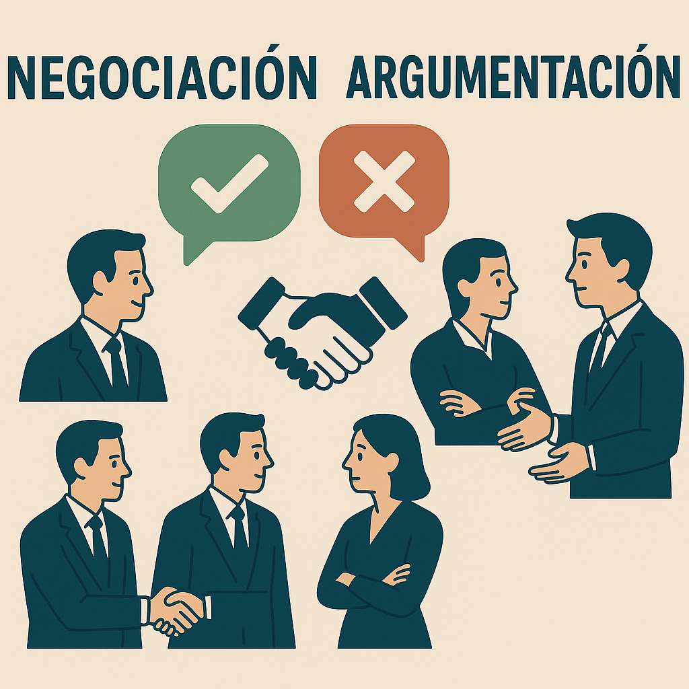

# Lección 3: Negociación y argumentación 🤝

## 🎯 Objetivos de la lección
- 🗣️ **Dominar** el léxico de acuerdos, conflictos y soluciones en contextos profesionales.  
- 🧭 **Aplicar** funciones discursivas al debatir, negociar y refutar propuestas.  
- 🏗️ **Integrar** estructuras concesivas, condicionales B₁/B₂ y conectores formales para argumentar con precisión.  
- ✍️ **Manejar** perífrasis verbales, pasiva refleja e impersonalidad para aportar objetividad y cortesía. 

---

## 3.1 Léxico de acuerdos, conflictos y soluciones ⚖️

| Término / Expresión      | Tipo        | Definición breve                                                        | Ejemplo en contexto                                                                 |
|--------------------------|-------------|-------------------------------------------------------------------------|-------------------------------------------------------------------------------------|
| **Acuerdo marco**        | Sustantivo  | Convenio de alcance general que regula futuras negociaciones.           | “Firmamos un acuerdo marco con el proveedor para los próximos dos años.”            |
| **Pacto de caballeros**  | Locución    | Compromiso no escrito, basado en la confianza mutua.                   | “Existe un pacto de caballeros para no compartir la información confidencial.”      |
| **Arbitraje**            | Sustantivo  | Resolución de disputas mediante un tercero neutral.                     | “Si surge un conflicto de precios, acudiremos a arbitraje.”                        |
| **Conciliación**         | Sustantivo  | Búsqueda de puntos en común para resolver un desacuerdo.                | “Logramos la conciliación antes de presentar la demanda.”                           |
| **Concesión**            | Sustantivo  | Cesión parcial de una demanda para acercar posturas.                    | “Ofrecimos una ligera concesión en el plazo de entrega.”                            |
| **Rescindir**            | Verbo       | Anular un contrato o compromiso.                                        | “La empresa puede rescindir el contrato con 30 días de aviso.”                      |
| **Rebatir**              | Verbo       | Contradecir un argumento con razones fundamentadas.                    | “El director rebatió la crítica presentando datos de ventas.”                       |
| **Mediación**            | Sustantivo  | Intervención de un tercero para facilitar el diálogo.                   | “Propusimos la mediación de la Cámara de Comercio.”                                 |
| **Renegociar**           | Verbo       | Revisar los términos de un acuerdo existente.                          | “Renegociaremos las tarifas si aumenta el volumen de pedido.”                       |
| **Litigio**              | Sustantivo  | Proceso legal contencioso entre dos partes.                             | “Buscamos evitar el litigio mediante un acuerdo amistoso.”                          |

💡 **Tip**: Agrupa este vocabulario en tu glosario por tipo de proceso (preventivo, resolutivo, coercitivo) para memorizarlo mejor.

---

## 3.2 Funciones discursivas: debatir, negociar y refutar 🎙️

### a) Debatir 🗣️
| Estructura                        | Uso                                | Ejemplo                                                                       |
|-----------------------------------|------------------------------------|-------------------------------------------------------------------------------|
| **“Desde mi punto de vista…”**    | Introducir opinión fundamentada    | “Desde mi punto de vista, la propuesta carece de datos financieros sólidos.”  |
| **“Consideremos también que…”**   | Añadir argumento                   | “Consideremos también que la competencia ya ofrece ese servicio.”            |
| **Pregunta retórica**             | Dirigir la reflexión               | “¿Realmente podemos asumir ese riesgo sin ampliar capital?”                   |

### b) Negociar 🤝
 
| Estrategia lingüística            | Fórmula                            | Ejemplo                                                                       |
|-----------------------------------|------------------------------------|-------------------------------------------------------------------------------|
| **Ofrecer alternativas**          | “Podríamos valorar…”               | “Podríamos valorar un descuento por volumen en lugar de ampliar el plazo.”    |
| **Condicionar la oferta**         | “Estaríamos dispuestos a… si…”     | “Estaríamos dispuestos a invertir 50 000 € si garantizan exclusividad.”        |
| **Mostrar flexibilidad**          | “Tenemos margen para…”             | “Tenemos margen para mover las fechas de entrega una semana.”                 |

### c) Refutar ❌
| Recurso                           | Ejemplo                                                                                           |
|-----------------------------------|---------------------------------------------------------------------------------------------------|
| **Datos comparativos**            | “Las cifras de mercado indican un crecimiento del 3 %, no del 10 %.”                              |
| **Contraejemplo**                 | “El año pasado probamos esa estrategia y las ventas cayeron.”                                     |
| **Conector concesivo + impersonal** | “Aunque se suele pensar lo contrario, se ha demostrado que la medida encarece el proceso.”      |

---

## 3.3 Gramática avanzada integrada 🛠️

### Estructuras concesivas y condicionales B₁/B₂  
| Variante                            | Estructura                                                       | Matiz que aporta                                             | Ejemplo                                                                                       |
|-------------------------------------|------------------------------------------------------------------|--------------------------------------------------------------|-----------------------------------------------------------------------------------------------|
| **B₁ (casi realidad)**              | Si + **presente** de indicativo → condicional compuesto / pluscuamperfecto de subj. | Subraya que la condición estuvo a punto de cumplirse.        | “Si llegas un minuto antes, **habrías cerrado** el trato en persona.”                          |
| **B₂ (consecuencia segura)**        | Si **pluscuamperfecto** de subjuntivo → **presente**/imperfecto de indicativo | Resalta la certeza de la consecuencia.                       | “Si no hubiéramos ampliado capital, **estamos** ahora en números rojos.”                      |

> ✔️ **Recuerda:** B₁ y B₂ se usan en registros orales profesionales para enfatizar cercanía temporal o inevitabilidad.

### Conectores discursivos formales  
| Función               | Conector          | Ejemplo                                                        |
|-----------------------|-------------------|----------------------------------------------------------------|
| **Introducir argumento** | “En primer lugar,” | “En primer lugar, conviene analizar el coste total.”          |
| **Contrastar**        | “No obstante,”     | “No obstante, el riesgo reputacional sigue presente.”         |
| **Conceder parcialmente** | “Aun así,”       | “Aun así, comprendemos su preocupación por los plazos.”       |
| **Conclusión**        | “En síntesis,”     | “En síntesis, la inversión reportará beneficios a medio plazo.” |

### Perífrasis verbales, pasiva refleja e impersonalidad  
| Recurso                              | Ejemplo                                                   | Efecto comunicativo                                               |
|--------------------------------------|-----------------------------------------------------------|-------------------------------------------------------------------|
| **Perífrasis de obligación** (*haber de* + infinitivo) | “Habría de revisarse el protocolo antes de firmar.”       | Suaviza la imposición, mantiene formalidad.                       |
| **Pasiva refleja**                   | “Se aprobaron las cláusulas sin objeciones.”              | Destaca la acción sobre el agente; estilo institucional.          |
| **Impersonal con “se”**              | “Se recomienda diferir parte del pago.”                   | Consejo impersonal para no personalizar el mensaje.               |

---

## 📚 Recursos extra
- 📄 **Ejercicios prácticos**: [Ejercicios3.pdf](Ejercicios3.pdf)  
- 📚 **Anexo EPUB**: Glosario ampliado con términos de negociación y argumentación.  

---

## 🎉 ¡Enhorabuena!
Has completado la Lección 3: *Negociación y argumentación*.  
¡Nos vemos en el Proyecto Final! 🚀  

